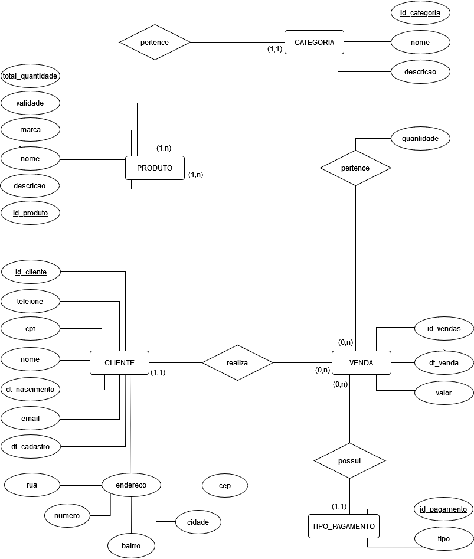
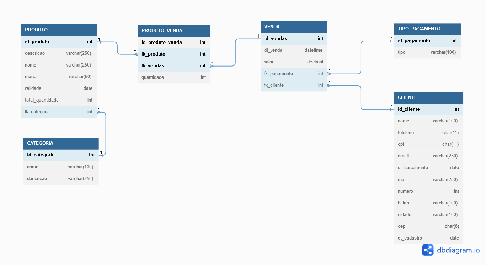

# CONTROLE DE FARMÁCIA

**Julio dos Reis Firmino, jrfirmino@sga.pucminas.br**

**Eduardo Henrique Morais Costa, eduardo.costa.1187487@sga.pucminas.br**

**Hudson Suvalsky Vieira, hudson.suvalsky@sga.pucminas.br**

**Carlos Gabriel Campos Gaspar, carlos.gaspar.1429414@sga.pucminas.br**

**Jeziel Suzana Pires da Silva, jeziel.pires@sga.pucminas.br**

---

Professores:

**Juliana Amaral Baroni de Carvalho**

---

_Curso de Sistemas de Informação - Instituto de Informática e Ciências Exatas – Pontifícia Universidade de Minas Gerais (PUC MINAS), Belo Horizonte – MG – Brasil_

---

_**Resumo**. Este estudo busca desenvolver uma modelagem primária do processo de negócio farmacêutico, considerando a notável presença desse setor na sociedade. O objetivo é desenhar um fluxo eficiente e funcional, aplicando as regras de negócio ao contexto, embora sem se aprofundar nas peculiaridades de cada empresa, dada a sua diversidade.
Na proposta, todos os componentes dos processos de negócios são considerados, direcionando os recursos organizacionais para objetivos predefinidos. O cliente é o participante chave e a modelagem do processo é centrada em suas necessidades. Para a estruturação deste processo de negócio, a ferramenta SydleOne foi utilizada, permitindo uma modelagem eficiente e flexível._

---

## 1. Introdução

Este trabalho tem por finalidade realizar a modelagem primária do processo de negócio de uma farmácia. Todo o estudo desenvolvido referente ao processo de negócio de uma farmácia foi trabalhado com foco no contexto desse tipo de negócio que está presente no cotidiano dos usuários. O objetivo é criar uma proposta de solução que viabiliza um fluxo de processos capaz de garantir eficiência e funcionalidade de uma empresa farmacêutica. A proposta irá entender e aplicar, dentro do contexto de modelagem de processos de negócios, as diversas regras de que envolvem esse tipo de atividade, ou seja, todo o fluxo será mapeado levando em consideração o início e o fim de todos os passos que deverão ser claramente mapeados.

O trabalho se torna relevante quando consideramos os dados mais atualizados do Conselho Federal de Farmácia do Brasil (2021). A instituição relata que, em 2020 existiam 89.879 Farmácias e drogarias comerciais no Brasil. Além das 8.506 farmácias de manipulação, 6.771 farmácias hospitalares e 6.771 farmácias públicas. Todas as farmácias possuem processos que podem ser melhorados e agilizados, vide o propósito do trabalho. 

    1.1 Contextualização
    
Cabe ressaltar que o norteador desta atividade será as regras de negócios que representam as atividades essenciais para se alcançar os objetivos corporativos previamente definidos, contudo, cada instituição possui as suas particularidades culturais e adota as suas práticas específicas e tais medidas as tornam únicas em seu contexto empresarial, desta forma a modelagem em particular desses tipos de cases não será abordado nesse trabalho, tendo em vista a infinidade de empresas do ramo. 

Por fim o desenvolvimento da proposta considerou todos os componentes pertencentes aos processos de negócios, tais como: clientes externos e internos, fornecedores internos e externos, insumos e atividades. Toda a proposta baseou-se no objetivo primordial de orientar recursos organizacionais em direção a objetivos definidos e possibilitar que o mapeamento possa maximizar o retorno esperado que foi definido no âmbito corporativo. 

    1.2 Problema

Em seguida o aluno deve caminhar a contextualização para descrever o **problema** que o artigo trata. 
O **problema** pode ser algo vivido em uma empresa específica. Neste caso, o aluno deve rapidamente apresentar 
o cenário de problema da empresa. A empresa só deve ser citada explicitamente se o aluno tiver autorização 
para tal.

    1.3 Objetivo geral

Como objetivo geral do sistema temos a facilitação do processo de integração entre os consumidores e revendedores no setor farmacêutico. Auxiliando a partir de um sistema na compra, venda e organização de medicamentos de acordo com oferta e demanda.

Em relação aos objetivos específicos do sistema, temos a possibilidade de visualização do histórico e periodicidade de compra dos produtos, assim como o auxílio no controle de estoque a partir da segmentação dos medicamentos por validade e lote. 

        1.3.1 Objetivos específicos

Viabilizar um fluxo de processos capaz de garantir eficiência e funcionalidade de uma empresa farmacêutica. A proposta irá entender e aplicar, dentro do contexto de modelagem de processos de negócios, as diversas regras de que envolvem esse tipo de atividade, ou seja, todo o fluxo será mapeado levando em consideração o início e o fim de todos os passos que deverão ser claramente mapeados.

    1.4 Justificativas

O setor farmacêutico no Brasil é um dos mais importantes do país, e é indiscutível que a tecnologia e a inovação são essenciais para o desenvolvimento do setor, sendo necessário que as farmácias estejam sempre atualizadas com as últimas tecnologias e sistemas de informação para gerenciar seus estoques e prestar atendimento ao cliente.

Porém, muitas vezes os processos fundamentais para o funcionamento de um serviço não são bem mapeados, com deficiência nos processos básicos como controle de estoque e atendimento ao cliente. Portanto, com soluções e controles simples, mas eficazes, podemos resolver uma série de desafios e problemas na operação diária de uma farmácia e na compra de medicamentos por parte de clientes. 

## 2. Participantes do processo

- **Fornecedores:** São empresas ou pessoas que fornecem os medicamentos e outros produtos vendidos pela farmácia, quando os fornecedores são confiáveis no seu tempo de entrega e recebimento garantirão um bom fluxo de produtos na farmácia. Além disso ajuda a manter um estoque diversificado e atualizado, com produtos de qualidade e preços acessíveis. 
- **Farmacêuticos e Técnicos de farmácia:** Profissionais que trabalham em conjunto para interpretar receitas médicas, preparar medicamentos, dispensar medicamentos, dar orientações aos clientes, fornecer informações sobre medicamentos, gerenciar estoques físicos, agir na organização da farmácia e no atendimento ao cliente. 
- **Funcionários administrativos:** São os funcionários que gerenciam as atividades administrativas e financeiras da farmácia, como contabilidade, recursos humanos e gestão de estoques no sistema. 
- **Clientes:** São os participantes chave que vão comprar medicamentos e produtos na farmácia. Eles podem ser pacientes que precisam de medicamentos prescritos por um médico, ou podem ser clientes que procuram produtos de cuidados pessoais, suplementos alimentares, entre diversos outros. 

## 3. Modelagem do processo de negócio

## 3.1. Análise da situação atual

O processo de cadastro de clientes é mapeado para identificar o fluxo de atividades envolvido. O processo atual (AS-IS) é manual e utiliza fichas físicas em suporte papel para armazenar as informações dos clientes. No entanto, este método pode ser ineficiente e problemático, pois as informações precisam ser recuperadas manualmente sempre que há necessidade de consulta ou atualização do cadastro.

No processo AS-IS de cadastro de produto, temos um processo excessivamente manual, pouco ágil que gera um gargalo de tempo. Após reunir os dados dos medicamentos eles são preenchidos em linhas e colunas de planilha para serem enviadas sempre para o crivo da Gerência e posteriormente para definir o destino dos dados, ficando um processo muito demorado e pouco prático.

A modelagem AS-IS desenvolvida mapeou o workflow de uma farmácia e nessa atividade foi possível verificar a indisponibilidade de oferecer para os clientes novas formas de pagamento de produto, além da inexistência de uma metodologia sistémica de comunicação entre a área de cadastramento de produto, especialmente, quando um determinado produto não está disponível na organização. 

## 3.2. Descrição Geral da proposta
Muitos os problemas enfrentados pelas farmácias que possuem potencial ganho com a automatização. Logo, também são muitas as opções de processos manuais e ineficientes que podem ser agilizados e melhorados com o uso de sistemas de informação. A melhoria desses processos traz um potencial de ganho de capital, fidelização do cliente, repetibilidade e agilização dos processos internos.

União entre os clientes e o revendedor, para facilitar:
- O Atendimento ao cliente: É uma das principais preocupações das farmácias, uma vez que muitas vezes precisam atender a um grande número de pacientes com necessidades variadas. A falta de pessoal e o treinamento inadequado podem levar a problemas de atendimento ao cliente e à insatisfação dos pacientes.
- Pressão para atingir metas de vendas: as farmácias muitas vezes enfrentam a pressão de atingir metas de vendas, o que pode levar a práticas antiéticas ou a venda de produtos desnecessários. Essa pressão também pode afetar negativamente a qualidade do atendimento ao cliente.
- Desafios tecnológicos: as farmácias precisam estar sempre atualizadas com as últimas tecnologias e sistemas de informação para gerenciar seus estoques e prestar atendimento ao cliente. Além disso, as farmácias também enfrentam ameaças cibernéticas e ataques de hackers.
  
Problemas:
- Compra de remédios com baixa visibilidade do estoque. 
- Falta de diversidades de Fornecedores. 
- Pressão de atingir metas de vendas. 
- A falta de pessoal e o treinamento inadequado. 
- Ineficiências no atendimento ao cliente. Perda de oportunidades de revenda. 

Solução: 
- Histórico de compras dos produtos. 
- Visualização da periodicidade de vendas dos medicamentos 
- Segmentação dos medicamentos por validade. (Prateleira de 3, 6, 9 meses…) 

Processos:
- Cadastro de Clientes. 
- Cadastro de Produtos. 
- Controle de Vendas. 
- Vendas de medicamentos. 

## 3.3. Modelagem dos Processos

### 3.3.1 Processo 1 – PROCESSO DE CADASTRO DE CLIENTES

Apresente aqui o nome e as oportunidades de melhorias para o processo 1. Em seguida, apresente o modelo do processo 1, descrito no padrão BPMN.

### 3.3.2 Processo 2 – PROCESSO DE CADASTRO DE PRODUTOS

Apresente aqui o nome e as oportunidades de melhorias para o processo 2. Em seguida, apresente o modelo do processo 2, descrito no padrão BPMN.

### 3.3.3 Processo 3 – PROCESSO DE VENDAS

Apresente aqui o nome e as oportunidades de melhorias para o processo 2. Em seguida, apresente o modelo do processo 2, descrito no padrão BPMN.

## 4. Projeto da Solução

### 4.1. Detalhamento das atividades

Descrever aqui cada uma das propriedades das atividades de cada um dos processos. Devem estar relacionadas com o modelo de processo apresentado anteriormente.

#### Processo 1 – NOME DO PROCESSO

**Nome da atividade 1**

| **Campo** | **Tipo** | **Restrições** | **Valor default** |
| --- | --- | --- | --- |
| [Nome do campo] | [Área de texto, Caixa de texto, Número, Data, Imagem, Seleção única, Múltipla escolha, Arquivo, Link, Tabela] |  |  |
| ***Exemplo:***  |    |     |
| login | Caixa de Texto | formato de e-mail |  |
| senha | Caixa de Texto | mínimo de 8 caracteres |   |

**Nome da atividade 2**

| **Campo** | **Tipo** | **Restrições** | **Valor default** |
| --- | --- | --- | --- |
| [Nome do campo] | [Área de texto, Caixa de texto, Número, Data, Imagem, Seleção única, Múltipla escolha, Arquivo, Link, Tabela] |  |  |
|    |    |     |

#### Processo 2 – NOME DO PROCESSO

**Nome da atividade 1**

| **Campo** | **Tipo** | **Restrições** | **Valor default** |
| --- | --- | --- | --- |
| [Nome do campo] | [Área de texto, Caixa de texto, Número, Data, Imagem, Seleção única, Múltipla escolha, Arquivo, Link, Tabela] |  |  |
|    |    |     |

**Nome da atividade 2**

| **Campo** | **Tipo** | **Restrições** | **Valor default** |
| --- | --- | --- | --- |
| [Nome do campo] | [Área de texto, Caixa de texto, Número, Data, Imagem, Seleção única, Múltipla escolha, Arquivo, Link, Tabela] |  |  |
|    |    |     |

### 4.2. Tecnologias

O projeto foi desenvolvido com o uso da ferramenta **SYDLE ONE** no qual foi realizado o mapeamento de processos e a automação.

## 5. Modelo de dados
Projeto de arquitetura de dados da solução proposta

**Modelo Relacional**

**Diagrama Entidade Relacionamento (DER)**

## 6. Indicadores de desempenho

Apresente aqui os principais indicadores de desempenho e algumas metas para o processo. Atenção: as informações necessárias para gerar os indicadores devem estar contempladas no diagrama de classe. Colocar no mínimo 5 indicadores.

Usar o seguinte modelo:

| **Indicador** | **Objetivos** | **Descrição** | **Cálculo** | **Fonte dados** | **Perspectiva** |
| --- | --- | --- | --- | --- | --- |
| Quanto foi vendido no mês | Avaliar quanto foi vendido no mês | Somatório do valor de todos os produtos vendidos no mês |   | Tabela de vendas | Processo de vendas |
| Valor vendido por cada categoria de produto no mês | Avaliar quais categorias possuem maior fluxo de venda | Somatório do valor de cada produto vendido no mês |  | Tabela de vendas | Processo de vendas |
| Valor vendido por cada tipo de pagamento no mês | Avaliar a relevância dos meios de pagamento ofertados | Somatório das vendas realizadas pelas modalidades de pagamento disponibilizada no mês |   | Tabela de vendas e tabela de tipos de pagamentos | Processo de vendas |
| Valor médio das vendas realizadas pelos clientes | Avaliar o ticket médio realizado pelos clientes | Valor médio pago pelos clientes |   | Tabela de vendas | Processo de vendas |
| Número de novos clientes cadastrados | Avaliar o crescimento no número de novos cadastros | Somatório de novos clientes adquiridos |   | Tabela de clientes | Processo de cadastro de clientes |

Obs.: todas as informações para gerar os indicadores devem estar no diagrama de classe **a ser proposto**

## 7. Sistema desenvolvido

Faça aqui uma breve descrição do software e coloque as principais telas com uma explicação de como usar cada uma.

## 8. Conclusão

Na construção deste projeto foi realizado a modelagem de processos de negócio de uma farmácia, no qual foi elaborado em grupo propostas de soluções que buscaram assegurar a eficiência e funcionalidade de uma empresa farmacêutica. A proposta foi desenvolvida levando em conta todos os elementos-chave dos processos de negócios, com foco em maximizar o retorno esperado. A modelagem de processos de negócios visa inicialmente o mapeamento do processo existente no qual a empresa esteja trabalhando (processo AS-IS), durante essa fase o mapeamento apresentou o estado atual do processo que estava suportando a empresa e foi percebido diversos pontos de melhorias que poderiam contribuir para o ganho de eficiência no negócio que foi objeto de estudo. 

A evolução da primeira fase com o estudo focado na modelagem de futuro (TO-BE) da empresa que teve por finalidade implantar melhorias no processo existente. Diante desta nova fase do projeto foi realizado o mapeamento do trabalho desenvolvido, com o uso da ferramenta Sydle One onde oferece a possibilidade de mapeamento de processos BPMN e a automação do fluxo na mesma ferramenta. Toda a base acadêmica trabalhada pela universidade preparou os integrantes no entendimento, elaboração e análise das diversas fases do projeto. A mentoria oferecida ajudou a corrigir e a focar nos objetivos de cada entrega, fazendo que a cada nova interação fosse possível observar uma melhoria contínua nos entregáveis do projeto que estava em desenvolvimento.  

A limitação de fazer todo o projeto com o uso da ferramenta Sydle One trouxe a percepção que em diversos momentos o grande limitador era o uso da ferramenta que prioritariamente deve facilitar e não impor maiores obstáculo. Em caso de uma entrega para um cliente externo, a adoção de uma ferramenta mais consolidada no mercado, que possua uma documentação clara de uso e que exija uma curva de aprendizado menos acentuada, passaria ser objeto de análise para a adoção da ferramenta na construção do projeto. Cabe ressaltar que obstáculos desta natureza implica em aumento do tempo de projeto o que tende em um aumento de custo. 

Contudo foi possível experimentar o gerenciamento de projeto por meio de metodologia ágil como o Kanbam e trabalhar questão envolvidas ao design de banco de dados e a construção de DER, alem de planejarmos as próximas entregas quando finalizava cada interação. 

# REFERÊNCIAS

Como um projeto de software não requer revisão bibliográfica, a inclusão das referências não é obrigatória. No entanto, caso você deseje incluir referências relacionadas às tecnologias, padrões, ou metodologias que serão usadas no seu trabalho, relacione-as de acordo com a ABNT.

Verifique no link abaixo como devem ser as referências no padrão ABNT:

http://www.pucminas.br/imagedb/documento/DOC\_DSC\_NOME\_ARQUI20160217102425.pdf

**[1.1]** - _ELMASRI, Ramez; NAVATHE, Sham. **Sistemas de banco de dados**. 7. ed. São Paulo: Pearson, c2019. E-book. ISBN 9788543025001._

**[1.2]** - _NIELD, Thomas. **Getting Started with SQL**. A Hands-on Approach forBeginners. Sebastopol: O’Reilly, 2016. Capítulos 1 e 2. LivroEletrônico._

**[1.2]** - _COPPIN, Ben. **Inteligência artificial**. Rio de Janeiro, RJ: LTC, c2010. E-book. ISBN 978-85-216-2936-8._

**[1.3]** - _CORMEN, Thomas H. et al. **Algoritmos: teoria e prática**. Rio de Janeiro, RJ: Elsevier, Campus, c2012. xvi, 926 p. ISBN 9788535236996._

**[1.4]** - _SUTHERLAND, Jeffrey Victor. **Scrum: a arte de fazer o dobro do trabalho na metade do tempo**. 2. ed. rev. São Paulo, SP: Leya, 2016. 236, [4] p. ISBN 9788544104514._

**[1.5]** - _RUSSELL, Stuart J.; NORVIG, Peter. **Inteligência artificial**. Rio de Janeiro: Elsevier, c2013. xxi, 988 p. ISBN 9788535237016._

# APÊNDICES

**Colocar link:**

Do código (armazenado no repositório);

Dos artefatos (armazenado do repositório);

Da apresentação final (armazenado no repositório);

Do vídeo de apresentação (armazenado no repositório).

