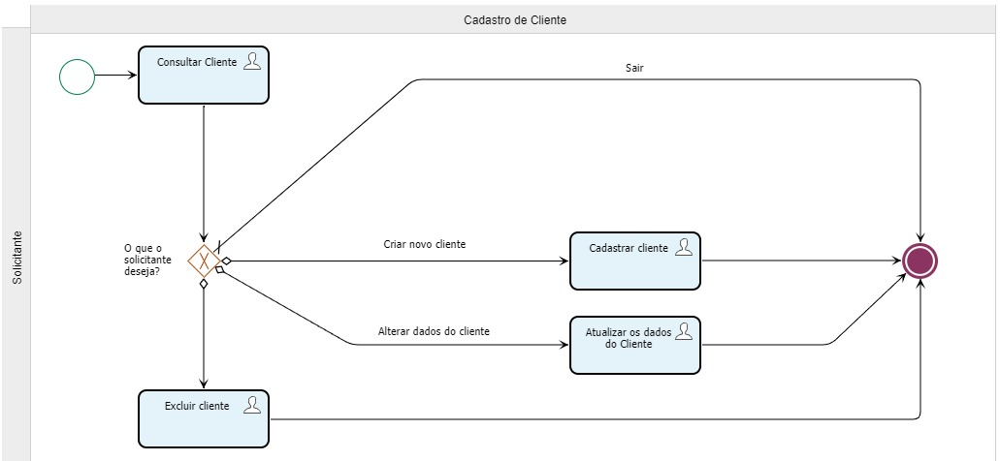
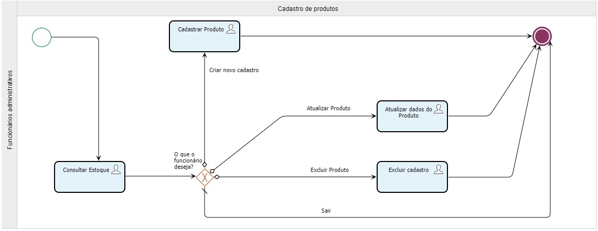
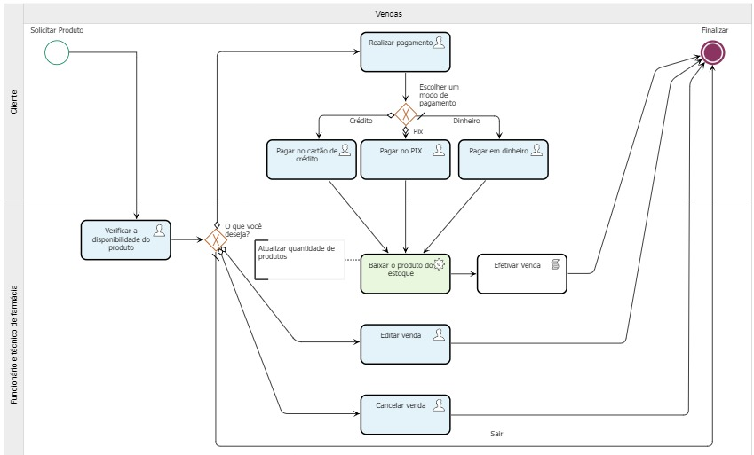

# CONTROLE DE FARMÁCIA

**Julio dos Reis Firmino, email: jrfirmino@sga.pucminas.br**

**Eduardo Henrique Morais Costa, email: eduardo.costa.1187487@sga.pucminas.br**

**Hudson Suvalsky Vieira, email: hudson.suvalsky@sga.pucminas.br**

**Carlos Gabriel Campos Gaspar, email: carlos.gaspar.1429414@sga.pucminas.br**

**Jeziel Suzana Pires da Silva, email: jeziel.pires@sga.pucminas.br**

---

Professores:

**Juliana Amaral Baroni de Carvalho**

---

_Curso de Sistemas de Informação - Instituto de Informática e Ciências Exatas – Pontifícia Universidade de Minas Gerais (PUC MINAS), Belo Horizonte – MG – Brasil_

---

_**Resumo**. Este estudo busca desenvolver uma modelagem primária do processo de negócio farmacêutico, considerando a notável presença desse setor na sociedade. O objetivo é desenhar um fluxo eficiente e funcional, aplicando as regras de negócio ao contexto, embora sem se aprofundar nas peculiaridades de cada empresa, dada a sua diversidade.
Na proposta, todos os componentes dos processos de negócios são considerados, direcionando os recursos organizacionais para objetivos predefinidos. O cliente é o participante chave e a modelagem do processo é centrada em suas necessidades. Para a estruturação deste processo de negócio, a ferramenta SydleOne foi utilizada, permitindo uma modelagem eficiente e flexível._

---

## 1. Introdução

&nbsp;&nbsp;&nbsp;&nbsp;Este trabalho tem por finalidade realizar a modelagem primária do processo de negócio de uma farmácia. Todo o estudo desenvolvido referente ao processo de negócio de uma farmácia foi trabalhado com foco no contexto desse tipo de negócio que está presente no cotidiano dos usuários. O objetivo é criar uma proposta de solução que viabiliza um fluxo de processos capaz de garantir eficiência e funcionalidade de uma empresa farmacêutica. A proposta irá entender e aplicar, dentro do contexto de modelagem de processos de negócios, as diversas regras de que envolvem esse tipo de atividade, ou seja, todo o fluxo será mapeado levando em consideração o início e o fim de todos os passos que deverão ser claramente mapeados.

&nbsp;&nbsp;&nbsp;&nbsp;O trabalho se torna relevante quando consideramos os dados mais atualizados do Conselho Federal de Farmácia do Brasil (2021). A instituição relata que, em 2020 existiam 89.879 Farmácias e drogarias comerciais no Brasil. Além das 8.506 farmácias de manipulação, 6.771 farmácias hospitalares e 6.771 farmácias públicas. Todas as farmácias possuem processos que podem ser melhorados e agilizados, vide o propósito do trabalho. 

    1.1 Contextualização
    
&nbsp;&nbsp;&nbsp;&nbsp;Cabe ressaltar que o norteador desta atividade será as regras de negócios que representam as atividades essenciais para se alcançar os objetivos corporativos previamente definidos, contudo, cada instituição possui as suas particularidades culturais e adota as suas práticas específicas e tais medidas as tornam únicas em seu contexto empresarial, desta forma a modelagem em particular desses tipos de cases não será abordado nesse trabalho, tendo em vista a infinidade de empresas do ramo. 

&nbsp;&nbsp;&nbsp;&nbsp;Por fim o desenvolvimento da proposta considerou todos os componentes pertencentes aos processos de negócios, tais como: clientes externos e internos, fornecedores internos e externos, insumos e atividades. Toda a proposta baseou-se no objetivo primordial de orientar recursos organizacionais em direção a objetivos definidos e possibilitar que o mapeamento possa maximizar o retorno esperado que foi definido no âmbito corporativo. 

    1.2 Problema

&nbsp;&nbsp;&nbsp;&nbsp;O processo de cadastro de clientes é mapeado para identificar o fluxo de atividades envolvido. Atualmente, o processo é todo manual e utiliza fichas físicas em suporte papel para armazenar as informações dos clientes. No entanto, este método pode ser ineficiente e problemático, pois as informações precisam ser recuperadas manualmente sempre que há necessidade de consulta ou atualização do cadastro.

&nbsp;&nbsp;&nbsp;&nbsp;No processo de cadastro de produto, temos um processo excessivamente manual, pouco ágil que consume um tempo excessivo criando um gargalo no processo. Após reunir os dados dos medicamentos eles são preenchidos em linhas e colunas de planilha para serem enviadas sempre para o crivo da Gerência e posteriormente para definir o destino dos dados, ficando um processo muito demorado e pouco prático.

&nbsp;&nbsp;&nbsp;&nbsp;No processo de venda foi analisado a indisponibilidade de oferecer para os clientes novas formas de pagamento de produto, além da inexistência de uma metodologia sistémica de comunicação entre a área de cadastramento de produto, especialmente, quando um determinado produto não está disponível na organização. 

    1.3 Objetivo geral

&nbsp;&nbsp;&nbsp;&nbsp;Como objetivo geral do sistema temos a facilitação do processo de integração entre os consumidores e revendedores no setor farmacêutico. Auxiliando a partir de um sistema na compra, venda e organização de medicamentos de acordo com oferta e demanda.

&nbsp;&nbsp;&nbsp;&nbsp;Em relação aos objetivos específicos do sistema, temos a possibilidade de visualização do histórico e periodicidade de compra dos produtos, assim como o auxílio no controle de estoque a partir da segmentação dos medicamentos por validade e lote. 

        1.3.1 Objetivos específicos

&nbsp;&nbsp;&nbsp;&nbsp;Viabilizar um fluxo de processos capaz de garantir eficiência e funcionalidade de uma empresa farmacêutica. A proposta irá entender e aplicar, dentro do contexto de modelagem de processos de negócios, as diversas regras de que envolvem esse tipo de atividade, ou seja, todo o fluxo será mapeado levando em consideração o início e o fim de todos os passos que deverão ser claramente mapeados.

    1.4 Justificativas

&nbsp;&nbsp;&nbsp;&nbsp;O setor farmacêutico no Brasil é um dos mais importantes do país, e é indiscutível que a tecnologia e a inovação são essenciais para o desenvolvimento do setor, sendo necessário que as farmácias estejam sempre atualizadas com as últimas tecnologias e sistemas de informação para gerenciar seus estoques e prestar atendimento ao cliente.

&nbsp;&nbsp;&nbsp;&nbsp;Porém, muitas vezes os processos fundamentais para o funcionamento de um serviço não são bem mapeados, com deficiência nos processos básicos como controle de estoque e atendimento ao cliente. Portanto, com soluções e controles simples, mas eficazes, podemos resolver uma série de desafios e problemas na operação diária de uma farmácia e na compra de medicamentos por parte de clientes. 

## 2. Participantes do processo

- **Fornecedores:** São empresas ou pessoas que fornecem os medicamentos e outros produtos vendidos pela farmácia, quando os fornecedores são confiáveis no seu tempo de entrega e recebimento garantirão um bom fluxo de produtos na farmácia. Além disso ajuda a manter um estoque diversificado e atualizado, com produtos de qualidade e preços acessíveis. 
- **Farmacêuticos e Técnicos de farmácia:** Profissionais que trabalham em conjunto para interpretar receitas médicas, preparar medicamentos, dispensar medicamentos, dar orientações aos clientes, fornecer informações sobre medicamentos, gerenciar estoques físicos, agir na organização da farmácia e no atendimento ao cliente. 
- **Funcionários administrativos:** São os funcionários que gerenciam as atividades administrativas e financeiras da farmácia, como contabilidade, recursos humanos e gestão de estoques no sistema. 
- **Clientes:** São os participantes chave que vão comprar medicamentos e produtos na farmácia. Eles podem ser pacientes que precisam de medicamentos prescritos por um médico, ou podem ser clientes que procuram produtos de cuidados pessoais, suplementos alimentares, entre diversos outros. 

## 3. Modelagem do processo de negócio

## 3.1. Análise da situação atual

&nbsp;&nbsp;&nbsp;&nbsp;O processo de cadastro de clientes é mapeado para identificar o fluxo de atividades envolvido. O processo atual (AS-IS) é manual e utiliza fichas físicas em suporte papel para armazenar as informações dos clientes. No entanto, este método pode ser ineficiente e problemático, pois as informações precisam ser recuperadas manualmente sempre que há necessidade de consulta ou atualização do cadastro.

&nbsp;&nbsp;&nbsp;&nbsp;No processo AS-IS de cadastro de produto, temos um processo excessivamente manual, pouco ágil que gera um gargalo de tempo. Após reunir os dados dos medicamentos eles são preenchidos em linhas e colunas de planilha para serem enviadas sempre para o crivo da Gerência e posteriormente para definir o destino dos dados, ficando um processo muito demorado e pouco prático.

&nbsp;&nbsp;&nbsp;&nbsp;A modelagem AS-IS desenvolvida mapeou o workflow de uma farmácia e nessa atividade foi possível verificar a indisponibilidade de oferecer para os clientes novas formas de pagamento de produto, além da inexistência de uma metodologia sistémica de comunicação entre a área de cadastramento de produto, especialmente, quando um determinado produto não está disponível na organização. 

## 3.2. Descrição Geral da proposta
&nbsp;&nbsp;&nbsp;&nbsp;Muitos os problemas enfrentados pelas farmácias que possuem potencial ganho com a automatização. Logo, também são muitas as opções de processos manuais e ineficientes que podem ser agilizados e melhorados com o uso de sistemas de informação. A melhoria desses processos traz um potencial de ganho de capital, fidelização do cliente, repetibilidade e agilização dos processos internos.

União entre os clientes e o revendedor, para facilitar:
- O Atendimento ao cliente: É uma das principais preocupações das farmácias, uma vez que muitas vezes precisam atender a um grande número de pacientes com necessidades variadas. A falta de pessoal e o treinamento inadequado podem levar a problemas de atendimento ao cliente e à insatisfação dos pacientes.
- Pressão para atingir metas de vendas: as farmácias muitas vezes enfrentam a pressão de atingir metas de vendas, o que pode levar a práticas antiéticas ou a venda de produtos desnecessários. Essa pressão também pode afetar negativamente a qualidade do atendimento ao cliente.
- Desafios tecnológicos: as farmácias precisam estar sempre atualizadas com as últimas tecnologias e sistemas de informação para gerenciar seus estoques e prestar atendimento ao cliente. Além disso, as farmácias também enfrentam ameaças cibernéticas e ataques de hackers.
  
Problemas:
- Compra de remédios com baixa visibilidade do estoque. 
- Falta de diversidades de Fornecedores. 
- Pressão de atingir metas de vendas. 
- A falta de pessoal e o treinamento inadequado. 
- Ineficiências no atendimento ao cliente. Perda de oportunidades de revenda. 

Solução: 
- Histórico de compras dos produtos. 
- Visualização da periodicidade de vendas dos medicamentos 
- Segmentação dos medicamentos por validade. (Prateleira de 3, 6, 9 meses…) 

Processos:
- Cadastro de Clientes. 
- Cadastro de Produtos. 
- Controle de Vendas. 
- Vendas de medicamentos. 

## 3.3. Modelagem dos Processos

### 3.3.1 Processo 1 – PROCESSO DE CADASTRO DE CLIENTES

&nbsp;&nbsp;&nbsp;&nbsp;A solução proposta para os problemas identificados no processo de cadastro de clientes no modelo AS-IS é a digitalização do processo. Essa solução é benéfica para aumentar a eficiência e agilidade no processo de cadastro de clientes. Com a digitalização, os clientes terão menos transtornos ao realizar o cadastro ou atualizar seus dados, o que incentivará a realização dessas atividades.  

&nbsp;&nbsp;&nbsp;&nbsp;Além disso, a digitalização do processo traz melhorias significativas na segurança das informações dos clientes, pois os documentos digitais são menos suscetíveis a avarias, perda e acesso não autorizado aos dados. Isso garante maior proteção aos dados dos clientes e reduz os riscos de violações de segurança.  

&nbsp;&nbsp;&nbsp;&nbsp;A implementação da solução de digitalização também proporciona melhorias na gestão de processos da empresa, pois torna o processo de cadastro de clientes mais eficiente e rápido, resultando em uma melhor experiência do cliente. Com essa solução, a empresa pode garantir uma gestão de processos mais eficiente e atualizada, além de contribuir para uma melhor imagem da marca perante os clientes.

### 3.3.2 Processo 2 – PROCESSO DE CADASTRO DE PRODUTOS

&nbsp;&nbsp;&nbsp;&nbsp;No processo TO-BE de cadastro de produto, temos um processo que inicia com a consulta do estoque para evitar o cadastro de produtos desnecessários, e caso seja necessário é utilizado um sistema próprio para revisão dos dados, assim descentralizando o papel de participação da gerência desde o início, sendo necessário somente a revisão do gerente em caso de inconsistência dos dados recebidos.  

&nbsp;&nbsp;&nbsp;&nbsp;Em caso de inconsistência, é possível realizar o preenchimento no sistema de cadastro de produtos diretamente para posterior publicação. No entanto, caso seja necessária a revisão do gerente, no lugar do envio de e-mails para comunicação e status, é alterada diretamente no sistema de cadastro dos dados se o cadastro do produto será negado ou aprovado.

### 3.3.3 Processo 3 – PROCESSO DE VENDAS

&nbsp;&nbsp;&nbsp;&nbsp;Processo de modelagem e gestão de processos de negócios utilizado para vendas. O desenvolvimento desta modelagem tem por finalidade apresentar um workflow que visa apresentar uma abordagem de futuro dos modelos de processos da organização. melhorar e trazer eficiência ao modelo existente da empresa. 

&nbsp;&nbsp;&nbsp;&nbsp;Com foco no tipo de processo no qual está inserido o processo de venda, foi desenvolvido um novo workflow que considera as características de um processo primário no qual inclui a atividade finalística e essencial para a organização. o foco na entrega de valor para os usuários é uma parte essencial do mapeamento de processo de negócio pois ajuda no suporte de soluções que permitem o crescimento do negócio. 

&nbsp;&nbsp;&nbsp;&nbsp;A modelagem TO-BE desenvolvida apresenta novas definições de fluxos com o objetivo de suportar uma maior eficiência as atividades fins da organização. A análise permitiu apresentar um fluxo de pagamento que tem o objetivo de inserir as principais metodologias de mercado para esse tipo de serviço. A necessidade de prever uma atividade de reportar a falta de algum produto solicitado pelo cliente foi inserido nessa abordagem de visão processual de futuro da referida organização. 

## 4. Projeto da Solução

### 4.1. Detalhamento das atividades

#### Processo 1 – PROCESSO DE CADASTRO DE CLIENTES

**Consultar Cliente**

| **Campo** | **Tipo** | **Restrições** | **Valor default** |
| --- | --- | --- | --- |
| O que você deseja? | Seleção única | Opções: [Cadastrar novo cliente, Atualizar dados cliente, Excluir dados cliente, Sair] |  |
| Cliente selecionado | Seleção única |     |
| Listagem de Cliente | Área de texto |     |

**Cadastrar Cliente**

| **Campo** | **Tipo** | **Restrições** | **Valor default** |
| --- | --- | --- | --- |
| Nome | Caixa de texto | Obrigatório | |
| CPF | Caixa de texto | Obrigatório | |
| Telefone | Caixa de texto | Obrigatório | |
| E-mail | Caixa de texto | Obrigatório | |
| Data de Nascimento | Data | Obrigatório |  |
| Rua | Caixa de texto | Obrigatório |  |
| Numero | Número | Obrigatório |  |
| Bairro | Caixa de texto | Obrigatório |  |
| Cidade | Caixa de texto | Obrigatório |  |
| CEP | Caixa de texto | Obrigatório |  |

**Atualizar os dados do Cliente**

| **Campo** | **Tipo** | **Restrições** | **Valor default** |
| --- | --- | --- | --- |
| Nome | Caixa de texto | Obrigatório | |
| CPF | Caixa de texto | Obrigatório | |
| Telefone | Caixa de texto | Obrigatório | |
| E-mail | Caixa de texto | Obrigatório | |
| Data de Nascimento | Data | Obrigatório |  |
| Rua | Caixa de texto | Obrigatório |  |
| Numero | Número | Obrigatório |  |
| Bairro | Caixa de texto | Obrigatório |  |
| Cidade | Caixa de texto | Obrigatório |  |
| CEP | Caixa de texto | Obrigatório |  |

**Excluir cliente**

| **Campo** | **Tipo** | **Restrições** | **Valor default** |
| --- | --- | --- | --- |
| Cliente selecionado | Seleção única | Obrigatório | |
| Confirma a exclusão do cliente selecionado? | Booleano | Opções: [Verdadeiro, Falso] |  |

#### Processo 2 – PROCESSO DE CADASTRO DE PRODUTOS

**Consultar Estoque**

| **Campo** | **Tipo** | **Restrições** | **Valor default** |
| --- | --- | --- | --- |
| Listagem Produtos | Área de texto |  |  |
| O que você deseja? | Seleção única | Opções: [Cadastrar novo produto, Alterar produto, excluir produto, Sair] |  |
| Produto selecionado | Seleção única |  |  |

**Cadastrar Produto**

| **Campo** | **Tipo** | **Restrições** | **Valor default** |
| --- | --- | --- | --- |
| Nome | Caixa de texto | Obrigatório | |
| Descrição | Caixa de texto | Obrigatório | |
| Marca | Caixa de texto | Obrigatório | |
| Validade | Data | Obrigatório | |
| Quantidade | Número | Obrigatório |  |
| Categoria | Seleção única |  |  |

**Atualizar dados do Produto**

| **Campo** | **Tipo** | **Restrições** | **Valor default** |
| --- | --- | --- | --- |
| Nome | Caixa de texto | Obrigatório | |
| Descrição | Caixa de texto | Obrigatório | |
| Marca | Caixa de texto | Obrigatório | |
| Validade | Data | Obrigatório | |
| Quantidade | Número | Obrigatório |  |
| Categoria | Seleção única |  |  |

**Excluir cadastro**

| **Campo** | **Tipo** | **Restrições** | **Valor default** |
| --- | --- | --- | --- |
| Produto selecionado | Seleção única |  | |
| Confirma a exclusão do cliente selecionado? | Booleano | Opções: [Verdadeiro, Falso] |  |

#### Processo 3 – PROCESSO DE VENDAS

**Verificar a disponibilidade do produto**

| **Campo** | **Tipo** | **Restrições** | **Valor default** |
| --- | --- | --- | --- |
| Listagem Produto | Tabela |  |  |
| O que você deseja? | Seleção única |  |  |
| Cliente selecionado | Seleção única |  |  |
| Produto selecionado | Seleção única |  |  |
| Quantidade de produtos | Caixa de texto |  |  |
| Venda Selecionada | Seleção única |  |  |

**Realizar pagamento**

| **Campo** | **Tipo** | **Restrições** | **Valor default** |
| --- | --- | --- | --- |
| Tipo Pagamento | Seleção única |  |  |

**Pagar no PIX**

| **Campo** | **Tipo** | **Restrições** | **Valor default** |
| --- | --- | --- | --- |
| Produto Selecionado | Área de texto |  |  |
| Tipo Pagamento | Área de texto |  |  |
| Confirmar Compra | Booleano |  |  |

**Pagar no Cartão de crédito**

| **Campo** | **Tipo** | **Restrições** | **Valor default** |
| --- | --- | --- | --- |
| Produto Selecionado | Área de texto |  |  |
| Tipo Pagamento | Área de texto |  |  |
| Confirmar Compra | Booleano |  |  |

**Pagar em dinheiro**

| **Campo** | **Tipo** | **Restrições** | **Valor default** |
| --- | --- | --- | --- |
| Produto Selecionado | Área de texto |  |  |
| Tipo Pagamento | Área de texto |  |  |
| Confirmar Compra | Booleano |  |  |

**Editar venda**

| **Campo** | **Tipo** | **Restrições** | **Valor default** |
| --- | --- | --- | --- |
| Cliente | Seleção única |  |  |
| Produto | Seleção única |  |  |
| Quantidade | Número |  |  |
| Valor | Decimal |  |  |
| Tipo de pagamento | Seleção única |  |  |

**Cancelar venda**

| **Campo** | **Tipo** | **Restrições** | **Valor default** |
| --- | --- | --- | --- |
| Venda Selecionada | Seleção única |  |  |
| Confirma o cancelamento da venda? | Booleano |  |  |

### 4.2. Tecnologias

O projeto foi desenvolvido com o uso da ferramenta **SYDLE ONE** no qual foi realizado o mapeamento de processos e a automação.

## 5. Projeto de Arquitetura de Dados

### 5.1. Modelo Relacional

### 5.2. Diagrama Entidade Relacionamento (DER)

## 6. Indicadores de desempenho

| **Indicador** | **Objetivos** | **Descrição** | **Cálculo** | **Fonte dados** | **Perspectiva** |
| --- | --- | --- | --- | --- | --- |
| Quanto foi vendido no mês | Avaliar quanto foi vendido no mês | Somatório do valor de todos os produtos vendidos no mês |  | Tabela de vendas | Processo de vendas |
| Valor vendido por cada categoria de produto no mês | Avaliar quais categorias possuem maior fluxo de venda | Somatório do valor de cada produto vendido no mês |  | Tabela de vendas | Processo de vendas |
| Valor vendido por cada tipo de pagamento no mês | Avaliar a relevância dos meios de pagamento ofertados | Somatório das vendas realizadas pelas modalidades de pagamento disponibilizada no mês |  | Tabela de vendas e tabela de tipos de pagamentos | Processo de vendas |
| Valor médio das vendas realizadas pelos clientes | Avaliar o ticket médio realizado pelos clientes | Valor médio pago pelos clientes |  | Tabela de vendas | Processo de vendas |
| Número de novos clientes cadastrados | Avaliar o crescimento no número de novos cadastros | Somatório de novos clientes adquiridos |  | Tabela de clientes | Processo de cadastro de clientes |

## 7. Sistema desenvolvido

Neste projeto, foi desenvolvido um software com foco na modelagem e otimização de processos de negócios em uma empresa farmacêutica. Foram elaboradas soluções coletivas para garantir a eficácia e operacionalidade do setor farmacêutico em geral, considerando os dados do Conselho Federal de Farmácia do Brasil. O software foi desenvolvido utilizando a ferramenta SYDLE ONE para digitalização e automação dos processos de negócios, com ênfase em três processos principais: cadastro de clientes, cadastro de produtos e processo de vendas.

Durante o desenvolvimento, todas as etapas dos processos de negócios foram consideradas, visando direcionar recursos organizacionais para metas específicas e maximizar o retorno esperado. No entanto, devido à diversidade de empresas no setor farmacêutico, a modelagem específica de casos individuais não foi abordada no projeto.

A equipe adquiriu experiência em boas práticas de design de banco de dados, planejamento de futuras entregas e seleção do tipo de banco de dados a ser adotado. A metodologia ágil Kanban foi utilizada para gerenciar o projeto, proporcionando orientação e foco nos objetivos de cada entrega.

Durante o projeto, foi observado que a ferramenta SYDLE ONE apresentou algumas limitações, o que levou à consideração de uma ferramenta mais estabelecida no mercado para um projeto futuro com um cliente externo, que ofereça uma documentação clara e uma curva de aprendizado mais suave.

Ao final do projeto, todos os requisitos foram atendidos e houve uma melhoria contínua nas entregas, contribuindo para a otimização do setor farmacêutico como um todo. O software desenvolvido atende às melhorias processuais planejadas em grupo e tem como objetivo melhorar a eficiência dos processos de negócios em uma instituição farmacêutica.

## 7.1. Principais telas dos processos criados

### 7.1.1 Cadastro de clientes:

1.0 - Cadastro e consulta:

1.1 - A tela abaixo refere-se a interface inicial para consulta dos clientes cadastrados ou para as opções de cadastrar cliente, atualizar dados do cliente e excluir cliente.

1.2 - A próxima tela refere-se ao questionário de preenchimento dos dados de um novo cliente.

2.0 - Atualizar dados do cliente

2.1 - Abaixo temos a interface para selecionar cliente para atualizar os dados.

2.2 - A próxima tela temos a interface do questionário para atualização dos dados e assim finalizar.

3.0 - Excluir cliente

3.1 - Abaixo temos a interface para escolher qual cliente vamos excluir.

3.2 - Abaixo temos a tela mostrando uma verificação se realmente deseja excluir o cliente selecionado.

### 7.1.2 Cadastro de produtos:

1.0 - Cadastro e consulta

1.1 - Abaixo temos a interface para consultar os produtos cadastrados na listagem ou selecionar alguma função de cadastro, exclusão ou atualização.

1.2 - A próxima tela selecionamos cadastrar novo produto, apresentando a interface para cadastro.

2.0 - Atualizar Produto

2.1 - Abaixo temos a tela para selecionar a função de "atualizar/alterar produto" e escolher qual produto cadastrado alterar.

2.2 - Na próxima tela temos o questinário com os dados do produto para atualização.

3.0 - Excluir Produto

3.1 Abaixo temos a tela para selecionar a "função excluir produto" e escolher qual vai ser deletado.

3.2 Na próxima tela temos a confirmação de exclusão ou não do produto selecionado.

### 7.1.3 Processo de vendas:

1.0 - Comprar Produto e Verficar disponibilidade

1.1 - Abaixo temos a interface apresentando os produtos disponíveis para a compra e a selecão da função "Comprar produto" , podendo selecionar também o cliente, produto e quantidade desejada.

1.2 - Na próxima tela temos a etapa de selecionar o tipo de pagamento.

1.3 - Temos abaixo a etapa de confirmação da compra para efetivar a venda/compra.

2.0 - Editar venda/compra

2.1 - Abaixo temos a interface para selecionar a função de "Editar Compra" e assim selecionar a compra do cliente desejado.

2.2 - Na próxima tela temos os dados da venda/compra com os campos disponíveis para alteração e assim efetivar a mudança desejada. 

3.0 - Excluir/Cancelar venda

3.1- Na próxima tela temos a seleção da função "Excluir Venda" e selecionar a venda que desejamos excluir.

3.2- Nesta etapa abaixo temos a visualização da venda e confirmação do cancelamento da compra.

## 8. Conclusão

&nbsp;&nbsp;&nbsp;&nbsp;Na construção deste projeto foi realizado a modelagem de processos de negócio de uma farmácia, no qual foi elaborado em grupo propostas de soluções que buscaram assegurar a eficiência e funcionalidade de uma empresa farmacêutica. A proposta foi desenvolvida levando em conta todos os elementos-chave dos processos de negócios, com foco em maximizar o retorno esperado. A modelagem de processos de negócios visa inicialmente o mapeamento do processo existente no qual a empresa esteja trabalhando (processo AS-IS), durante essa fase o mapeamento apresentou o estado atual do processo que estava suportando a empresa e foi percebido diversos pontos de melhorias que poderiam contribuir para o ganho de eficiência no negócio que foi objeto de estudo. 

&nbsp;&nbsp;&nbsp;&nbsp;A evolução da primeira fase com o estudo focado na modelagem de futuro (TO-BE) da empresa que teve por finalidade implantar melhorias no processo existente. Diante desta nova fase do projeto foi realizado o mapeamento do trabalho desenvolvido, com o uso da ferramenta Sydle One onde oferece a possibilidade de mapeamento de processos BPMN e a automação do fluxo na mesma ferramenta. Toda a base acadêmica trabalhada pela universidade preparou os integrantes no entendimento, elaboração e análise das diversas fases do projeto. A mentoria oferecida ajudou a corrigir e a focar nos objetivos de cada entrega, fazendo que a cada nova interação fosse possível observar uma melhoria contínua nos entregáveis do projeto que estava em desenvolvimento.  

&nbsp;&nbsp;&nbsp;&nbsp;A limitação de fazer todo o projeto com o uso da ferramenta Sydle One trouxe a percepção que em diversos momentos o grande limitador era o uso da ferramenta que prioritariamente deve facilitar e não impor maiores obstáculo. Em caso de uma entrega para um cliente externo, a adoção de uma ferramenta mais consolidada no mercado, que possua uma documentação clara de uso e que exija uma curva de aprendizado menos acentuada, passaria ser objeto de análise para a adoção da ferramenta na construção do projeto. Cabe ressaltar que obstáculos desta natureza implica em aumento do tempo de projeto o que tende em um aumento de custo. 

&nbsp;&nbsp;&nbsp;&nbsp;Contudo foi possível ter contato com o gerenciamento de projeto por meio do uso de metodologia ágil como o Kanbam além de colocarmos em prática as boas práticas relativas ao design de banco de dados, planejamento das próximas entregas e a análise de qual tipo de banco de dados deveríamos adotar levando em consideração as regras de negócio. Desta forma foi possível atender a todos os requisitos do projeto por meio das atividades desenvolvidas em cada interação, tal desenvolvimento possibilitou a construção de um software que atende as melhorias processuais planejadas em grupo e que tem por finalidade a melhora na eficiência processual das regras de negócio de uma instituição farmacêutica. 

# REFERÊNCIAS

**[1.1]** - _ELMASRI, Ramez; NAVATHE, Sham. **Sistemas de banco de dados**. 7. ed. São Paulo: Pearson, c2019. E-book. ISBN 9788543025001._

**[1.2]** - _NIELD, Thomas. **Getting Started with SQL**. A Hands-on Approach forBeginners. Sebastopol: O’Reilly, 2016. Capítulos 1 e 2. LivroEletrônico._

**[1.3]** - BEAULIEU, Alan. **Learning SQL**. Sebastopol: O’Reilly, 2020. Capítulos 1 e 2. Livro Eletrônico._

**[1.4]** - _VIESCAS, John L. **SQL Queries for Mere Mortals**. A Hands-On Guide to Data Manipulation in SQL. O’Reilly, 2020. Partes II e III e capítulos 13 e 14. Livro eletrônico._

**[1.5]** - _DATE, C. J. **Introdução a sistemas de bancos de dados**. Rio de Janeiro: Elsevier, 2004. Seções 3.8, 15.2, 15.3 e 17.6 e Livro Eletrônico._

**[1.6]** - _CODD, Edgar Frank. **A relational model of data for large shared data banks**. Communications of the ACM. 13(6):377–387. 1970._

**[1.7]** - _SADALAGE, Pramod J; FOWLER, Martin Fowler. **NoSQL Distilled: A Brief Guide to the Emerging World of Polyglot Persistence**. 1ed. Pearson, 2013._

# APÊNDICES

**Código:** (armazenado no repositório);

**Artefatos:** (armazenado do repositório);

**Apresentação final:** (armazenado no repositório);

**Vídeo de apresentação:** (armazenado no repositório).

